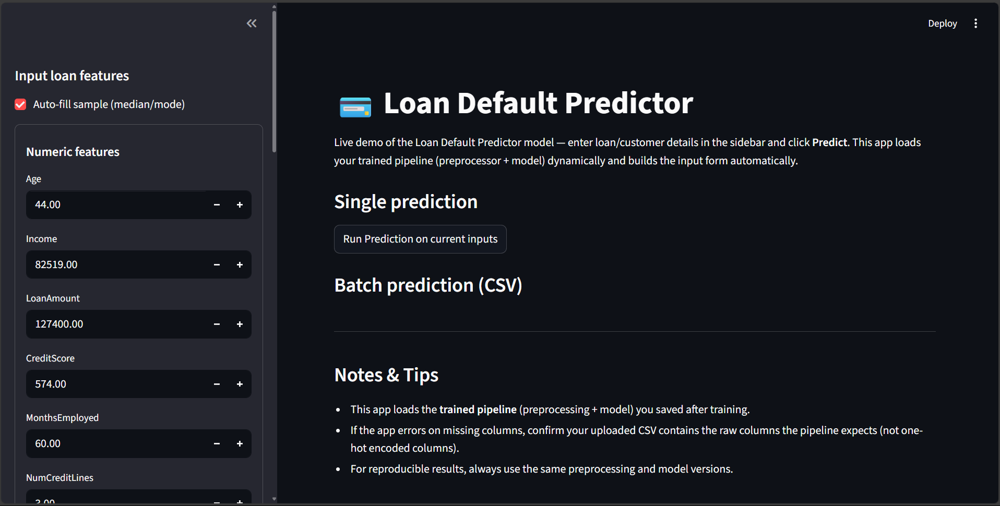
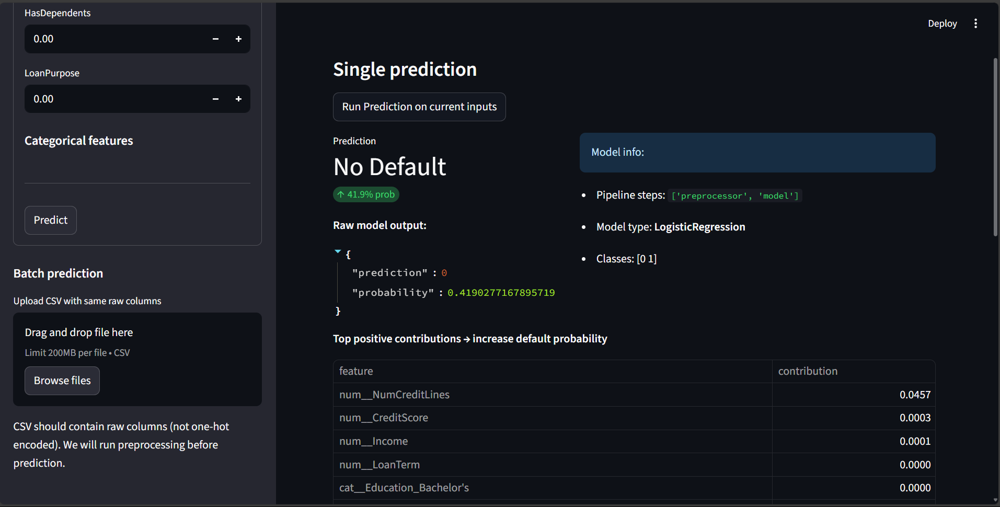

# 💳 Loan Default Predictor

An end-to-end **Machine Learning project** that predicts whether a customer is likely to **default on a loan**.
Built with **Python, Scikit-learn, Pandas, SQL, and Streamlit**, this project demonstrates the full ML lifecycle:
**EDA → Preprocessing → Model Training → Evaluation → Deployment (Streamlit App).**

---

## 🚀 Project Overview
- **Objective:** Predict loan default risk using customer + loan application data.
- **Dataset:** [Lending Club Loan Data (Kaggle)](https://www.kaggle.com/datasets/nikhil1e9/loan-default)
- **ML Pipeline:** Data cleaning, feature engineering, model training, evaluation.
- **Deployment:** Interactive web app built with Streamlit.

---

## 📊 Features
✅ Exploratory Data Analysis (EDA) with insights & visualizations
✅ Data Preprocessing (handling missing values, encoding, scaling)
✅ Feature Engineering & Selection
✅ Model Training with **Logistic Regression** & **Decision Tree**
✅ Model Evaluation (Accuracy, F1-Score, Classification Report)
✅ Deployment via **Streamlit Web App**
✅ **Explainability** using SHAP (local & global feature contributions)
✅ **Batch Predictions** via CSV upload

---

## 🏗️ Project Structure

Loan-Default-Predictor/
│
├── notebooks/ # Jupyter notebooks (EDA, preprocessing, training)
│ ├── 01_data_understanding.ipynb
│ ├── 02_data_cleaning_plan.ipynb
│ ├── 03_train_test_preprocessing.ipynb
│ ├── 04_model_training.ipynb
│
├── apps/
│ └── app.py # Streamlit app
│
├── models/
│ └── loan_default_model.pkl
│
├── data/
│ ├── data_raw/ # raw dataset
│ │     ├── Loan_default.csv
│ └── data_processed/ # cleaned dataset
|       ├── loan_clean.csv
│
├── requirements.txt # dependencies
├── README.md # project documentation
└── .gitignore # ignore venv, env files


---

## ⚙️ Installation & Setup

### 1️⃣ Clone the repository
```bash
git clone https://github.com/rohitraut1024/Loan-Default-Predictor.git
cd loan-default-predictor
```
### 2️⃣ Create virtual environment & install dependencies
```bash
python -m venv .venv
source .venv/bin/activate       # Mac/Linux
.venv\Scripts\activate          # Windows

pip install -r requirements.txt
```

### 3️⃣ Run the Streamlit app
```bash
streamlit run apps/app.py
```
---

## 🖼️ Screenshots

<p align="center">
  
  
</p>


---
## 📈 Model Performance

Best Model: Logistic Regression (balanced class weights)
```bash
Accuracy: ~85%

F1 Score: ~0.78
```

- Insights:

    1. Income, Loan Amount, Interest Rate, and Employment Length were top predictors.

    2. Higher Debt-to-Income ratio strongly correlated with defaults.

---

## 🤝 Contribution

Contributions are welcome!
Feel free to fork this repo and submit pull requests.

---

## 📜 License

This project is licensed under the MIT License.

👨‍💻 Author

Rohit Raut
rohitraut78253@gmail.com
https://www.linkedin.com/in/rohitraut1024/